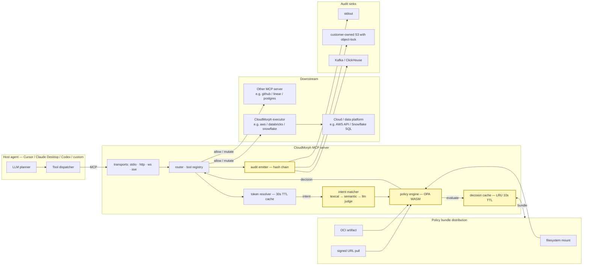
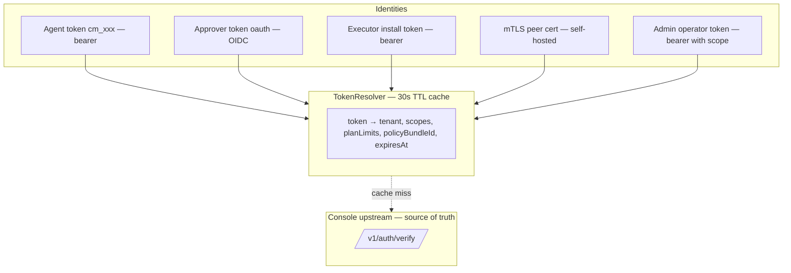
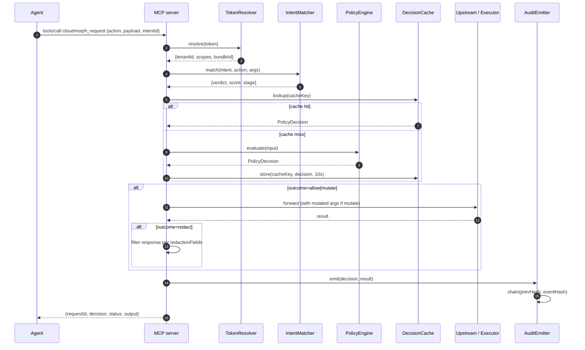
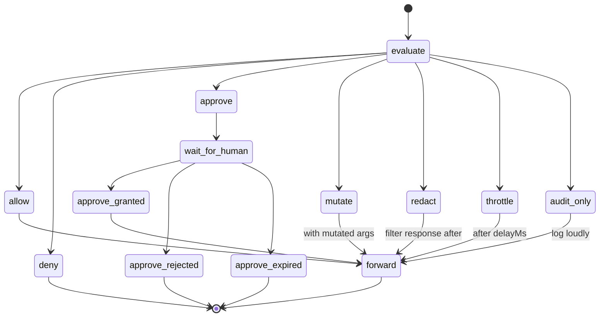
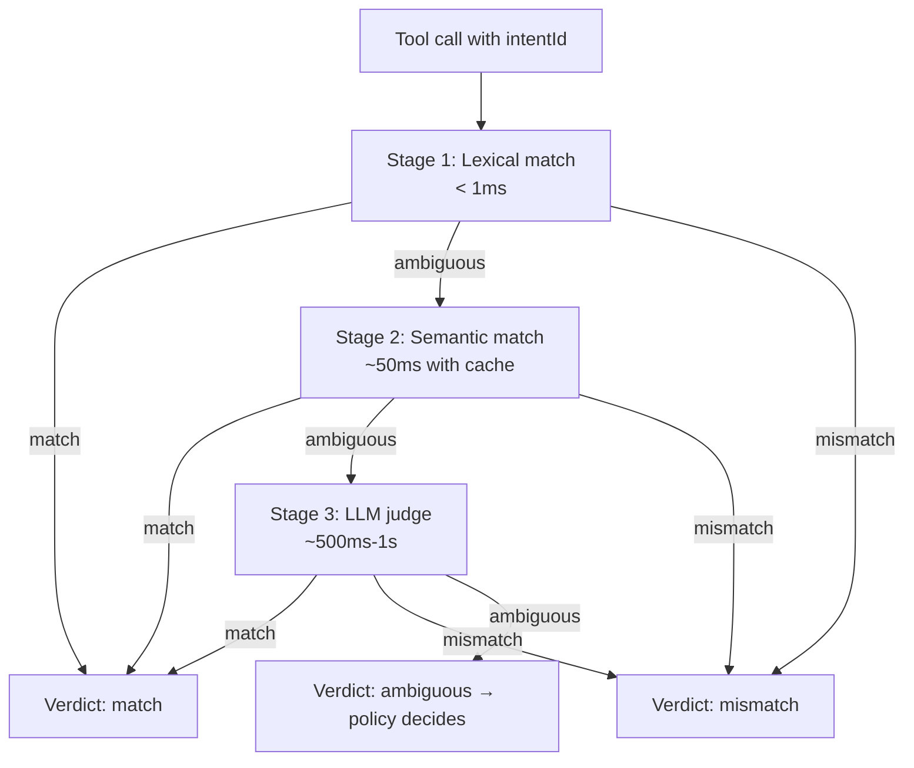
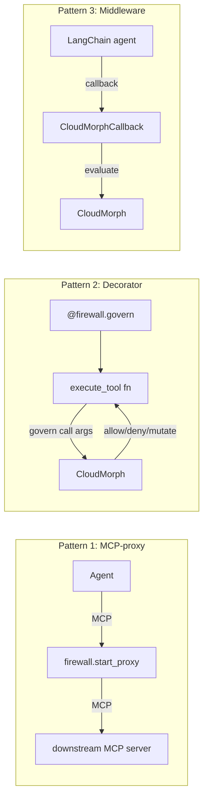
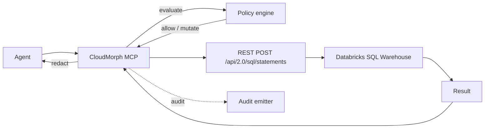
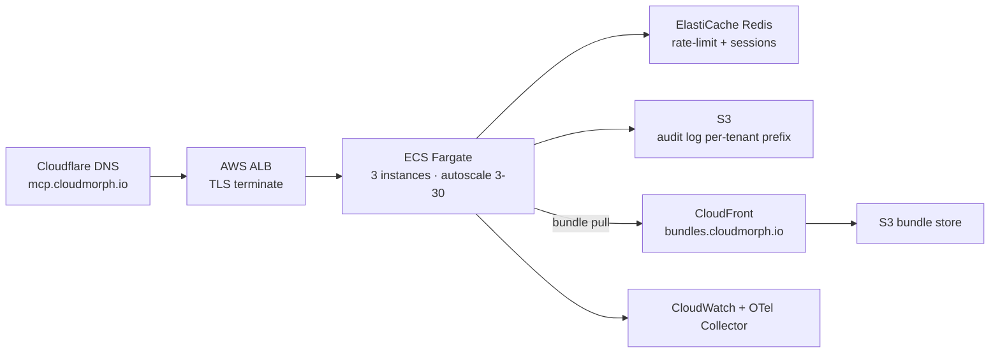

# ARCHITECTURE — CloudMorph Control Centre

_Single source of truth. Synthesized from the audits in `mcp/01`, `contracts/02`, `sdk/03`, `aws/04`, `azure/04`, `gcp/04`, `databricks/04`, `snowflake/04`, `policy/05`, `intent/06`, `cross/07-12`. Implementation plan in [BUILD_PLAN.md](BUILD_PLAN.md)._

---

## Table of contents

1. Product framing — what CloudMorph Control Centre is
2. System diagram
3. Multi-tenancy model
4. Auth & security model
5. MCP server architecture
6. Policy engine architecture
7. Intent system architecture
8. Audit log architecture
9. Contracts architecture
10. SDK architecture
11. Executor architecture
12. Cloud governance hooks per cloud
13. Data platform governance — Databricks + Snowflake
14. Container & deploy model
15. Observability
16. Failure modes
17. Cost-of-goods
18. Versioning & migration

---

## §1. Product framing

CloudMorph Control Centre is a **runtime firewall for agentic AI tool calls.** It sits in the hot path between an agent's planner and the tools the agent invokes:

- captures the agent's stated **intent** (what it says it's doing and why) before execution,
- evaluates intent + tool call + runtime context against declarative **policies** in a sub-50ms latency budget,
- returns one of seven decision outcomes (allow / deny / approve / mutate / redact / throttle / audit_only),
- emits a tamper-evident audit chain to customer-owned sinks.

It ships as:
- An **MCP server** that sits between the host agent and downstream MCP servers (the `cloudmorph_proxy` tool — the killer feature).
- A **Python SDK** for agents that don't speak MCP natively (raw Anthropic / OpenAI / LangChain loops).
- **Cloud + data platform executors** (AWS / Azure / GCP / Databricks / Snowflake) that emit governance signals so even direct-cloud calls leave a record.

The current repo (~9,144 LoC, last meaningful commit `def8f9a` 2026-02-10) implements **executor plumbing + a stateless gateway MCP**. The runtime firewall, intent layer, MCP-proxy, policy engine, and audit chain are unbuilt. The 14-day MVP in [BUILD_PLAN.md](BUILD_PLAN.md) ships the wedge.

**Wedge:** the `cloudmorph_proxy` MCP tool, paired with intent capture. Single MCP tool that adds value to *every other* MCP tool.

**Differentiator:** intent capture + intent-vs-action mismatch detection. No competitor does this today.

---

## §2. System diagram



Yellow boxes (engine, intent matcher, decision cache, audit emitter) are the four pieces that **don't exist today** and that Block D + E build.

Feedback loops (not shown in the linear flow):
- Decisions → audit log → replay test harness → bundle update
- Intent metrics → tenant dashboard → bundle author tunes rules
- Customer-owned audit sink → customer SIEM → customer alerting
- Bundle hot-reload → blue-green swap → new decisions evaluated against new bundle

---

## §3. Multi-tenancy model

```
Tenant
  ├── PolicyBundle (one active version)
  ├── Sessions      (live agent sessions; in-memory store + Redis post-MVP)
  │     └── Intents  (zero or more active intents per session, TTL'd)
  ├── Decisions     (cached 10s; persisted to audit log)
  ├── AuditChain    (per-tenant prevEventHash bookkeeping; per-tenant retention)
  ├── ExecutorTokens (one per cloud account)
  └── PlanLimits    (decisions/mo, audit retention, SSO, self-host)
```

Per-tenant namespace touches every internal data structure:
- Bundle distribution: `POLICY_BUNDLE_PATH=/etc/cloudmorph/bundles/${tenantId}/active.tar.gz` or URL with `${tenantId}` substitution.
- Decision cache key: `sha256(bundleId + bundleVersion + tenantId + canonicalJson({action, intentId, payload, runtimeContext.sessionTags}))`.
- Audit log: per-tenant prefix on S3 (`s3://audit-bucket/${tenantId}/...`); per-tenant retention.
- Session store: session id namespace (`tnt_abc:ses_xyz`); collision impossible across tenants.
- Metrics: `tenant_tier` label only; no `tenant_id` (cardinality control). Per-tenant drill-down via audit-log queries.

**Cross-tenant adversarial fixtures** in [cross/08_tests_audit.md §1.2 Layer 4](cross/08_tests_audit.md):
- `adv_tenant_cache_collision`
- `adv_tenant_audit_namespace`
- `adv_tenant_session_id_collision`

---

## §4. Auth & security model

Three layers of authentication; one identity model.



**Authentication mechanisms:**
- **Bearer tokens** (`Authorization: Bearer cm_xxx`) — primary, tokens minted upstream.
- **OIDC for approvers** — Google / GitHub / Okta, post-MVP.
- **mTLS for self-hosted** — peer cert subject CN → tenantId, post-MVP.
- **Session tokens for human dashboards** — short-lived, derived from OIDC.

**TokenResolver cache:** in-process LRU, 30s TTL. Eliminates the per-request upstream round trip. Cache hit ratio target > 90% steady state.

**JWT support:** if the bearer token is JWT-format, decode locally for the fast path (no upstream call until expiry).

**Per-tenant policy namespace:** every authenticated request carries `tenantId`; all downstream evaluation is scoped.

**Token rotation:** orthogonal — handled upstream. Rotated tokens invalidate the resolver cache via short TTL.

**Per-tenant fail-mode** (closed default) decides what happens when the policy engine is unhealthy.

Detail: [cross/10_security_and_tenancy_audit.md](cross/10_security_and_tenancy_audit.md).

---

## §5. MCP server architecture

```
cloudmorph-mcp/
├── src/
│   ├── index.ts                 # express bootstrap; sigterm handler; metrics endpoint mount
│   ├── transports/
│   │   ├── http.ts              # the existing express router (refactored)
│   │   ├── stdio.ts             # @modelcontextprotocol/sdk stdio adapter
│   │   ├── sse.ts               # @modelcontextprotocol/sdk SSE adapter
│   │   └── ws.ts                # existing WS hub
│   ├── tools/
│   │   ├── registry.ts          # central tool registry; injectable per-deployment
│   │   ├── cloudmorph_request.ts
│   │   ├── cloudmorph_request_status.ts
│   │   ├── cloudmorph_job_status.ts
│   │   ├── cloudmorph_declare_intent.ts        # NEW
│   │   ├── cloudmorph_revoke_intent.ts         # NEW
│   │   ├── cloudmorph_explain_decision.ts      # NEW
│   │   ├── cloudmorph_proxy.ts                 # NEW — the killer
│   │   ├── cloudmorph_session_start.ts
│   │   ├── cloudmorph_session_end.ts
│   │   ├── cloudmorph_list_sessions.ts
│   │   ├── cloudmorph_list_policies.ts
│   │   ├── cloudmorph_approve.ts
│   │   ├── cloudmorph_deny.ts
│   │   ├── cloudmorph_replay.ts                # post-MVP
│   │   └── cloudmorph_redact_preview.ts        # post-MVP
│   ├── auth/
│   │   ├── bearer.ts            # existing extraction
│   │   ├── resolver.ts          # NEW — token → (tenantId, ...) with cache
│   │   ├── jwt.ts               # NEW — local JWT parsing
│   │   └── mtls.ts              # post-MVP
│   ├── policy/
│   │   ├── engine.ts            # OPA WASM wrapper
│   │   ├── bundle.ts            # load + verify + hot-reload
│   │   ├── cache.ts             # LRU 10s TTL
│   │   └── types.ts
│   ├── intent/
│   │   ├── matcher.ts           # lexical → semantic → llm judge
│   │   ├── session_store.ts     # in-memory MVP, Redis post-MVP
│   │   └── verb_taxonomy.ts     # exported from cloudmorph-common-ts
│   ├── audit/
│   │   ├── emitter.ts
│   │   ├── chain.ts
│   │   ├── canonical_json.ts    # RFC 8785
│   │   └── sinks/{stdout,s3,buffered,kafka}.ts
│   ├── ratelimit.ts             # extend existing; add Redis backend
│   ├── health.ts                # extend existing; richer health
│   ├── metrics.ts               # NEW — Prometheus exposition
│   └── tracing.ts               # NEW — OTel SDK init
├── tests/
│   └── ... (see cross/08)
├── bench/
│   └── ... (autocannon scripts)
├── Dockerfile
├── package.json
└── tsconfig.json
```

Target: no file > 200 LoC after refactor (the current `routes.ts` at 583 LoC violates this — refactored across `tools/*.ts`).

**Request lifecycle (cloudmorph_request as example):**



Detail: [mcp/01_server_audit.md](mcp/01_server_audit.md).

---

## §6. Policy engine architecture

OPA WASM, embedded in-process. Bundle = signed tarball with Rego sources + pre-compiled WASM + data documents + manifest. Hot-reload via blue-green swap. Decision cache LRU keyed on `hash(bundleId, version, tenantId, canonicalJson(decision-relevant input))` with 10s TTL.

**Engine interface** (TypeScript):

```typescript
interface PolicyEngine {
  evaluate(input: PolicyInput): Promise<PolicyDecision>;
  reload(bundle: Buffer): Promise<void>;
  close(): Promise<void>;
  bundleId: string;
  bundleVersion: string;
}
```

Implementations: `OpaWasmEngine` (production), `MockEngine` (tests), `CedarEngine` (future swap behind same interface).

**7 decision outcomes (locked):**



**Rule taxonomy (8 categories):**
- Allowlist / denylist
- Intent-conditional
- Intent-vs-action divergence
- Time-of-day
- Approval-required
- Mutate
- Throttle
- Redact (response filtering)
- Cost
- Composite

Detail: [policy/05_policy_engine_design.md](policy/05_policy_engine_design.md).

---

## §7. Intent system architecture

Hybrid: structured `verbs[]` (strict 22-verb taxonomy) + free-form `statedGoal` (LLM-readable).

**Lifecycle:**

```
declare → bind to session → reference in tool calls → expire (TTL or session end) | revoke
```

**Mismatch detection cascade:**



**Stage 1 — Lexical:** verb-set intersection of `intent.structuredVerbs` and `ACTION_VERBS[action]`. Subset → match; partial → ambiguous; disjoint → mismatch.

**Stage 2 — Semantic (post-MVP for production quality):** embedding cosine similarity. `voyage-3-lite` remote or `all-MiniLM-L6-v2` local.

**Stage 3 — LLM judge (post-MVP for real, MVP stub):** Haiku 4.5 call with cached results.

**Configurable strictness:** `strict | balanced (default) | permissive`.

Detail: [intent/06_intent_system_design.md](intent/06_intent_system_design.md).

---

## §8. Audit log architecture

```
PolicyDecision → AuditEmitter → {chain, sign?} → SinkSelector → Sink₁, Sink₂, ...
                                                                   ↓ on failure
                                                              BufferedSink (disk-backed bounded queue)
                                                                   ↓ on retention exhausted
                                                              drop-oldest + alert
```

**Hash chain:**
- `eventHash = sha256(canonicalJson({...event, eventHash: "", signature: ""}))` (RFC 8785 JCS)
- Each event has `prevEventHash` pointing to the previous event for the same `tenantId`
- Tampering is detectable via verifier CLI: `npx @cloudmorph/audit-verify --bundle s3://...`

**Sinks (pluggable):**
- `stdout` — default; container log driver picks up
- `s3` — managed MCP-server-owned bucket
- `s3-customer-owned` — write-only cross-account role; **the compliance buyer story**
- `kafka` — post-MVP, customer's enterprise event bus
- `clickhouse` — post-MVP, customer's analytics warehouse
- `buffered` — wraps another sink; disk-backed bounded queue for failure mode

**Per-event Ed25519 signature** (post-MVP): for highest-assurance tenants. Public key in tenant settings; verifier CLI checks signature.

Detail: [contracts/02 §2.3 AuditEvent](contracts/02_contracts_audit.md), [mcp/01 §1.7](mcp/01_server_audit.md).

---

## §9. Contracts architecture

Source of truth: `contracts/*.schema.json`. JSON Schema draft-07. Generated artifacts:

- **Pydantic models** (Python via `datamodel-code-generator`) → `cloudmorph-common-py/cloudmorph_common/contracts/`
- **TypeScript interfaces** (via `json-schema-to-typescript`) → `cloudmorph-common-ts/src/contracts/`

Both consumed by SDK / executors / MCP server / common packages.

**Versioning:** every schema has `schemaVersion: "v0.1"`. Bumps:
- additive optional field → minor
- new required field, removal, rename, tightening → major
- bug fix → patch

CI gate diffs `schemaVersion` against base branch; fails if not bumped per category.

**SDK on version mismatch:** warns on minor mismatch, hard-rejects on major mismatch.

**12 contracts in MVP:**
1. Request (existing — update)
2. Job (existing — update)
3. Approval (existing — update)
4. **IntentDeclaration** (new)
5. **PolicyDecision** (new)
6. **AuditEvent** (new)
7. **RuntimeContext** (new)
8. **ToolCallRequest** (new)
9. Session (new)
10. PolicyBundle (new)
11. RedactionRule (new — post-MVP for actual use, but the schema lands MVP)
12. Action-payload schemas (per action, post-MVP)

Detail: [contracts/02_contracts_audit.md](contracts/02_contracts_audit.md).

---

## §10. SDK architecture

Three integration patterns:



**Class hierarchy:**

```
CloudMorph (sync, stdlib-only)        # current
AsyncCloudMorph (httpx-based)         # MVP add
CloudMorphError, RateLimitError       # current

cloudmorph.firewall                   # MVP module
  ├── wrap()                          # MCP-proxy primary
  ├── start_proxy()
  ├── govern (decorator)
  └── declare_intent / evaluate_tool_call

cloudmorph.adapters
  ├── anthropic.GovernedAnthropic     # MVP
  ├── openai.GovernedOpenAI           # MVP
  ├── bedrock.GovernedBedrock         # post-MVP
  ├── langchain.CloudMorphCallback    # MVP stretch
  ├── llamaindex.GovernedQueryEngine  # MVP stretch
  └── pydantic_ai.GovernedTool        # post-MVP
```

**Packaging:** `extras_require` per framework. Sigstore-signed PyPI releases.

Detail: [sdk/03_python_sdk_audit.md](sdk/03_python_sdk_audit.md).

---

## §11. Executor architecture

Five clouds × same shape. After Block C extraction:

```
cloudmorph_common.BaseExecutor
  ├── ExecutorConfig (Pydantic Settings, env-loaded)
  ├── ControlCenterClient (the lifecycle protocol)
  ├── ArtifactWriter (S3 / GCS / Blob subclasses)
  ├── AuditEmitter (mirrors MCP server impl)
  └── _execute_job (claim → heartbeat → run_action → complete)

class AwsExecutor(BaseExecutor):
    def run_action(self, job): return ACTIONS[job.action](job.payload)

# aws/executor/src/main.py shrinks to ~30 LoC:
if __name__ == "__main__":
    cfg = ExecutorConfig.from_env()
    client = ControlCenterClient(cfg.base_url, cfg.install_token)
    artifact = S3ArtifactWriter.from_env()
    audit = AuditEmitter.from_env()
    AwsExecutor(cfg, client, artifact, audit).run()
```

**Action handler registry** (per cloud, post Block G):

```python
# aws/executor/src/actions/__init__.py
from . import s3, ec2, ecs, iam, lambda_, ...

ACTIONS = {
    "aws.s3.list_buckets": s3.list_buckets,
    "aws.s3.list_objects": s3.list_objects,
    "aws.ec2.list_instances": ec2.list_instances,
    "aws.ecs.list_clusters": ecs.list_clusters,
    ...
}
```

Replaces 1,066 LoC of `if/elif` in `aws/executor/src/job_runner.py`.

Detail: [cross/07_common_layer_audit.md](cross/07_common_layer_audit.md), per-cloud audits.

---

## §12. Cloud governance hooks per cloud

Cross-cutting principle: **every executor emits cloud-native enforcement signals so even direct-cloud calls (bypassing MCP) leave a record and ideally are blockable.**

| Cloud | Signal | Effect |
|---|---|---|
| **AWS** | IAM session tagging via STS.AssumeRole + session tags | CloudTrail rows carry `cloudmorph:request_id`, `cloudmorph:intent_id` |
| **AWS** | EventBridge emitter | Customer-owned bus receives every decision |
| **AWS** | Permission-boundary compilation (post-MVP) | IAM enforces policy bundle even when MCP bypassed |
| **AWS** | Config rule emission for intents (post-MVP) | Config dashboard shows agent-vs-intent compliance |
| **Azure** | `x-ms-correlation-request-id` header injection | Activity Log carries correlation |
| **Azure** | Event Grid emitter | Customer topic receives decisions |
| **Azure** | Compile-to-Azure-Policy (post-MVP) | Native policy enforcement |
| **Azure** | Defender for Cloud finding (post-MVP) | Security Center alerts on `intent_mismatch` |
| **GCP** | OTel trace propagation in API calls | Cloud Audit Logs trace queryable |
| **GCP** | Eventarc / Pub/Sub emitter | Customer pipeline receives decisions |
| **GCP** | Compile-to-Org-Policy + IAM Conditions (post-MVP) | Native policy via CEL |
| **GCP** | Security Command Center finding (post-MVP) | SCC alerts |

Detail: per-cloud audits.

---

## §13. Data platform governance — Databricks + Snowflake

Higher-stakes than infra clouds. The wedge here is **query interception** not infra-action interception.

### Databricks



- **MVP wedge:** `databricks.sql.execute_query` action with sqlglot-based `mutate` rules (e.g., auto-add `LIMIT 10000`).
- **Post-MVP:** Unity Catalog row/column policy compile, cost gating via `EXPLAIN COST`, notebook governance (dbutils interception), Mosaic AI / Genie governance.

### Snowflake

- **MVP wedge:** `QUERY_TAG` injection on every query (2h work) + `snowflake.sql.execute_query` with sqlglot mutate.
- **Post-MVP:** compile to row-access policies, warehouse credit estimation, Cortex Agents governance, DML/DDL gating via policy engine.

Detail: [databricks/04_executor_audit.md](databricks/04_executor_audit.md), [snowflake/04_executor_audit.md](snowflake/04_executor_audit.md).

---

## §14. Container & deploy model

**Hosted SaaS first:**



**Containers:**
- `ghcr.io/cloudmorphai/cloudmorph-mcp:latest` (Node 20, multi-arch amd64+arm64, Cosign-signed, SBOM)
- `ghcr.io/cloudmorphai/control-center-base:python3.12-slim` (shared Python base)
- `ghcr.io/cloudmorphai/{aws,azure,gcp,databricks,snowflake}-executor:latest` (built FROM the base)

**Multi-arch:** all 6 images.

**Self-hosted:** post-MVP — Helm chart, Terraform module.

Detail: [cross/09_packaging_and_docker_audit.md](cross/09_packaging_and_docker_audit.md).

---

## §15. Observability

**SLOs (locked):**
- MCP `tools/call` cached: p99 < 20ms
- MCP `tools/call` cold: p99 < 50ms
- Decision correctness vs fixture suite: 100%
- Audit log durability: zero events lost
- Policy bundle hot-reload: < 5s end-to-end
- Hosted SaaS availability: 99.9%

**Stack:**
- Metrics: Prometheus exposition (`/metrics`); ~30 metrics. OTel Collector → Cloud Monitoring (hosted) or customer backend (self-hosted).
- Tracing: OpenTelemetry SDK; trace per request: `mcp.receive → token.resolve → intent.match → policy.evaluate → upstream.call → audit.emit`.
- Logs: JSON-line structured to stdout; CloudWatch (hosted) or container log driver.
- Customer-facing: `cloudmorph_explain_decision` MCP tool, `/api/v1/decisions/{id}` REST endpoint, sample Athena view.

**Alerting:** PagerDuty for P0/P1 on availability, audit sink failures, policy fail-open active. Slack for P2.

Detail: [cross/11_observability_and_slo.md](cross/11_observability_and_slo.md).

---

## §16. Failure modes

Single source of truth. Excerpt from [cross/10_security_and_tenancy_audit.md §1.10](cross/10_security_and_tenancy_audit.md):

| Failure | Impact | Detection | Mitigation |
|---|---|---|---|
| Policy engine OOM | All decisions error | OTel span err counter | k8s OOM-kill restart; per-tenant fail-mode |
| Bundle signature invalid | Reload aborts | Audit + alert | Continue prev bundle |
| Audit sink unreachable | Events stack up | Sink-emit failure metric | Buffer to disk (bounded); never silently drop |
| Audit local disk full | Buffer drops | Disk usage alert | Alert + page if > 80% |
| Redis unreachable | Rate-limit fails open OR sessions fail | Connect failure metric | Per-tenant fail-mode |
| Executor disconnected | Claimed jobs orphaned | Heartbeat timeout | Lease expiry + re-claim |
| Token resolver upstream unreachable | Token validation fails | Resolver miss rate | Per-tenant fail-mode |

**Fail-open vs fail-closed:** per-tenant config, default fail-closed. Fail-open active emits audit events every evaluation.

---

## §17. Cost-of-goods

Per-tenant per-month, hosted on AWS:

| Tier | Marginal cost ($/mo) | Decisions/day | Margin |
|---|---:|---:|---:|
| Free | ~$5 | 100 | -$5 (loss leader) |
| Pro ($50) | ~$5 | 1k | $45 (90%) |
| Team ($500) | ~$15 | 10k | $485 (97%) |
| Enterprise ($2000) | ~$80 | 100k | $1920 (96%) |

Detail: [cross/11_observability_and_slo.md §1.6](cross/11_observability_and_slo.md).

---

## §18. Versioning & migration

| Subsystem | Version model | Tagging |
|---|---|---|
| Contracts | semver per schema (`schemaVersion: "v0.1"`) | CI gate enforces bump category |
| Policy bundles | semver per bundle (`v1.0.0`) | Distribution path includes version |
| MCP server | semver, Apache 2.0 | `ghcr.io/cloudmorphai/cloudmorph-mcp:v0.1.0` |
| Common-py | locked to umbrella repo SHA pre-MVP; semver post-PyPI publish | tag `common-v0.1.0` |
| SDK | semver, target contract `schemaVersion` pinned | `cloudmorph==0.1.0` on PyPI |
| Executors | locked to umbrella repo SHA | `ghcr.io/cloudmorphai/aws-executor:v0.1.0` |

**SDK version mismatch behavior:**
- Server returns its `serverInfo.contractVersions: {request: "v0.1", intent: "v0.1", ...}` in `initialize` response.
- SDK warns on minor mismatch.
- SDK hard-rejects on major mismatch with `CloudMorphError("contract_version_mismatch")`.

**Bundle hot-reload migration:**
- Blue-green swap (described in §6); zero-downtime within same major.
- Major bumps require all clients to upgrade SDK first; coordinate via release notes.

**Breaking change policy:** documented in repo `CHANGELOG.md`. Breaking changes batched into major releases; min 30-day deprecation notice.

---

## Appendix A — what's deliberately not in this architecture

- Multi-region active-active for hosted SaaS. Single-region for MVP.
- Multi-cluster federation. Out of scope.
- Operator/CRD pattern for k8s. Post-MVP.
- A web UI in this repo. Lives in Console.
- A CLI tool in this repo. Could ship as `npx @cloudmorph/cli` later for ops.
- Real-time event streaming to customer dashboards. Polling-based is sufficient for MVP; SSE/WS post-MVP.
- Federation across multiple Control Centre instances. Single-instance per tenant for MVP.
- Cross-tenant policy library / marketplace. Premature.

---

## Appendix B — file map cross-reference

| Section | Files referenced |
|---|---|
| §5 | [mcp/01_server_audit.md](mcp/01_server_audit.md), [cloudmorph-mcp/src/](../cloudmorph-mcp/src/) |
| §6 | [policy/05_policy_engine_design.md](policy/05_policy_engine_design.md) |
| §7 | [intent/06_intent_system_design.md](intent/06_intent_system_design.md) |
| §8 | [contracts/02_contracts_audit.md §2.3](contracts/02_contracts_audit.md), [cross/10_security_and_tenancy_audit.md §1.6](cross/10_security_and_tenancy_audit.md) |
| §9 | [contracts/02_contracts_audit.md](contracts/02_contracts_audit.md) |
| §10 | [sdk/03_python_sdk_audit.md](sdk/03_python_sdk_audit.md) |
| §11 | [cross/07_common_layer_audit.md](cross/07_common_layer_audit.md), [aws/04_executor_audit.md](aws/04_executor_audit.md), [azure/04_executor_audit.md](azure/04_executor_audit.md), [gcp/04_executor_audit.md](gcp/04_executor_audit.md) |
| §13 | [databricks/04_executor_audit.md](databricks/04_executor_audit.md), [snowflake/04_executor_audit.md](snowflake/04_executor_audit.md) |
| §14 | [cross/09_packaging_and_docker_audit.md](cross/09_packaging_and_docker_audit.md) |
| §15 | [cross/11_observability_and_slo.md](cross/11_observability_and_slo.md) |
| §16 | [cross/10_security_and_tenancy_audit.md](cross/10_security_and_tenancy_audit.md) |
| §17 | [cross/11_observability_and_slo.md §1.6](cross/11_observability_and_slo.md) |
| Strategic locks | [cross/12_strategic_open_questions.md](cross/12_strategic_open_questions.md) |
| Implementation | [BUILD_PLAN.md](BUILD_PLAN.md) |
